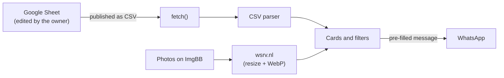

# Joyería Kalo — Jewelry Catalog

A mobile-first online catalog for a small jewelry business, updated from a Google Sheet without touching code.

**Live demo:** https://r3ss4k00-cmd.github.io/catalogo-joyas/

<!-- TODO: add mobile and desktop screenshots once the real product photos are uploaded -->

## The problem

Joyería Kalo is a real small jewelry business that sells through WhatsApp and Instagram. The owner needed a single link that shows every piece and that she could keep up to date on her own, without touching code.

## How it works

The owner edits a Google Sheet (one row per piece: name, type, material, status, photo link). The sheet is published as CSV, and the page fetches and renders it on every load. Photos are hosted on ImgBB and resized to WebP by wsrv.nl. Customers ask about a piece through WhatsApp, with a pre-filled message.



## Features

- Grid of cards with photo, name, status (available / reserved / sold) and "price on request".
- Two-level filters: type, then material (only the materials that exist for that type), plus an "available only" toggle.
- Detail view with a WhatsApp button. If the piece is sold or reserved, the button and message ask for a similar one.
- The phone's back button closes the detail view.
- Image fallback chain: resized photo → original photo → "No image" placeholder.
- Loading, error and empty states.

## Technical decisions

- **No framework.** It's one `index.html` with plain HTML, CSS and JavaScript. For a single page with a few interactions, a framework would add a build step without solving a real problem, and GitHub Pages serves the file as it is.
- **Google Sheets instead of a database.** The owner already knows how to use a spreadsheet. Dropdowns for type, material and status prevent typos, and an instructions tab explains how to add pieces. There's no backend, no login and no cost. The trade-off: the published CSV is public.
- **Sheet data is treated as untrusted input.** The sheet is edited by hand, so cards are built with `createElement` and `textContent`, and no sheet value ever reaches `innerHTML`. The CSV is read by a small character-by-character parser (`csvAFilas`) that handles quotes, escaped `""`, and commas or line breaks inside cells. An earlier version split the text into lines first, and a line break inside a cell could make a piece disappear without warning. Rows without a name or photo are skipped.
- **Accessibility as a requirement.** Cards are real `<button>` elements, so they work with the keyboard. The detail view is a `role="dialog"` with a focus trap, the rest of the page is `inert` while it's open, and focus returns to the card on close. Filters use `aria-pressed`, and an `aria-live` region announces how many pieces are shown. All text passes WCAG AA contrast (lowest pair: 5.1:1), and `prefers-reduced-motion` removes zoom and movement but keeps fades.

## Performance

PageSpeed Insights, mobile: **100 / 100 / 100 / 100** (Performance, Accessibility, Best Practices, SEO). [See the report](https://pagespeed.web.dev/analysis/https-r3ss4k00-cmd-github-io-catalogo-joyas/v7bwdtvfsx?form_factor=mobile).

Before and after the performance work (Lighthouse CLI, mobile, median of 3 runs, served locally):

| Metric | Before | After |
|---|---|---|
| Performance | 69 | **100** |
| First Contentful Paint | 2.93 s | 0.94 s |
| Largest Contentful Paint | 2.93 s | 1.66 s |
| Cumulative Layout Shift | 0.47 | **0** |

What fixed it: self-hosted fonts instead of Google Fonts, reserved space for content that loads from the sheet, preloading the LCP image (the hero background), and resized WebP photos with `srcset`.

## What I learned

<details>
<summary>Main takeaways</summary>

When I started, I was more comfortable with Python and C than with web development. The full log is in [PROGRESO.md](PROGRESO.md) (in Spanish).

- **Async JavaScript:** `fetch`, promises, and why rendering has to happen after the data arrives.
- **Don't trust external data:** validating rows, `textContent` vs. `innerHTML`, and parsing CSV as a small state machine.
- **Accessibility is mostly semantics:** buttons instead of clickable `div`s, `aria-pressed`, `aria-live`, `inert`, and why re-creating the focused element sends keyboard users back to `<body>`.
- **CSS:** mobile-first media queries, custom properties, specificity, `minmax(0, 1fr)`, `@starting-style`, and `dvh` with a `vh` fallback.
- **Measure before fixing:** the LCP element turned out to be the hero background, not the heading. Layout shift is fixed by reserving space before content arrives.

</details>

## Limitations and next steps

- **Third-party image services.** Photos depend on ImgBB and wsrv.nl, both free. If wsrv.nl fails, the page falls back to the original ImgBB photos (heavier). If ImgBB fails, a placeholder is shown.
- **Load time depends on Google Sheets.** Cards can't render until the CSV arrives, so the real experience (and the score) varies with Google's response time.
- **The published CSV is public.** Anyone with the link can read it, so nothing private can go in the sheet.
- **Content in progress.** Real photos, the real WhatsApp number and the Instagram account are still pending. The demo uses a placeholder phone number.
- **Next:** payment methods, an exchange policy and a home-screen icon for iPhone.

## Run locally

The sheet didn't load when opening `index.html` directly from disk (`file://`), so serve the folder over HTTP:

```bash
git clone https://github.com/r3ss4k00-cmd/catalogo-joyas.git
cd catalogo-joyas
python3 -m http.server 8000
```

Then open http://localhost:8000. The data source is the `URL_CSV` constant at the top of the script.

## How it was built

I built this with Claude Code as an AI assistant, working in stages: quality audit, design critique, copywriting, final review and performance. Each stage used specific skills: `web-quality-audit`, `web-design-guidelines`, `frontend-design`, `impeccable`, `emil-design-eng` and `copywriting`. I reviewed and approved every change, and logged what I learned in PROGRESO.md.
